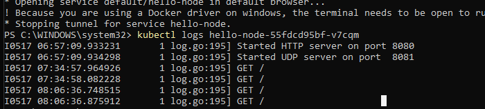
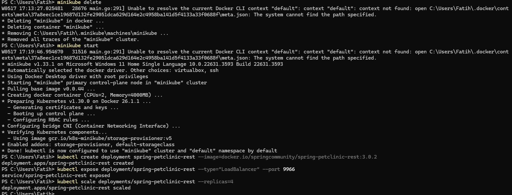
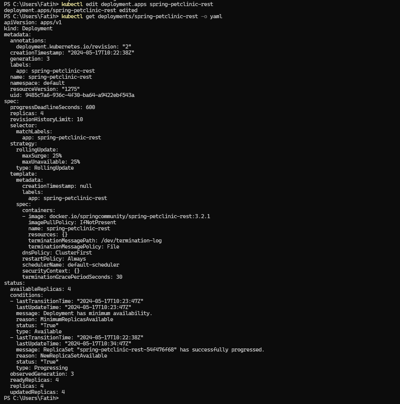
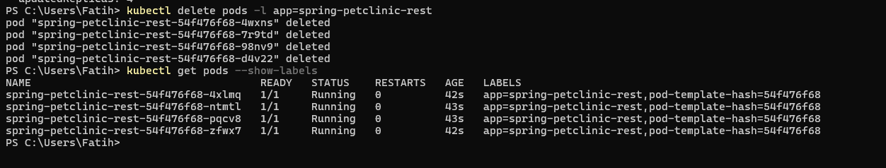
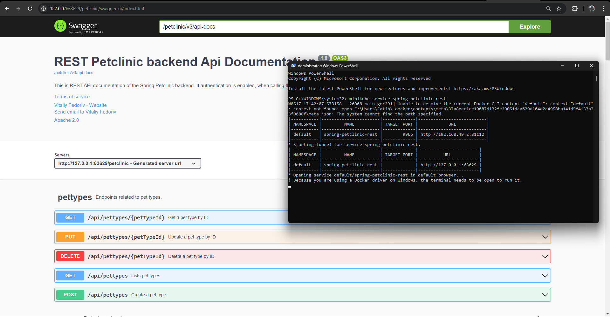
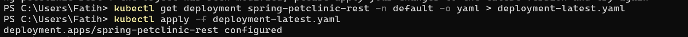
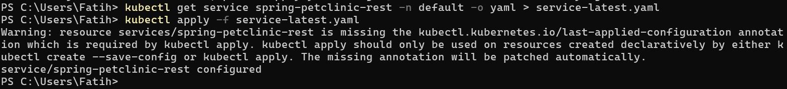
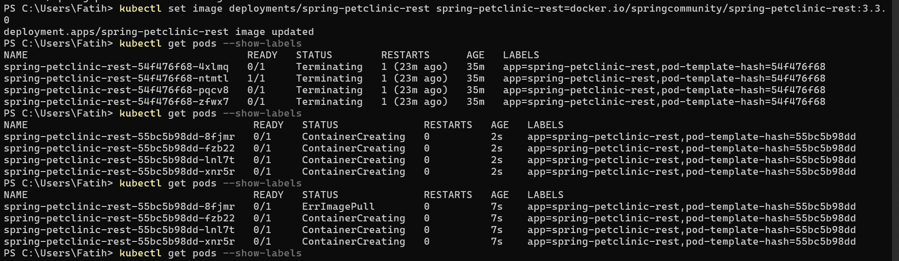
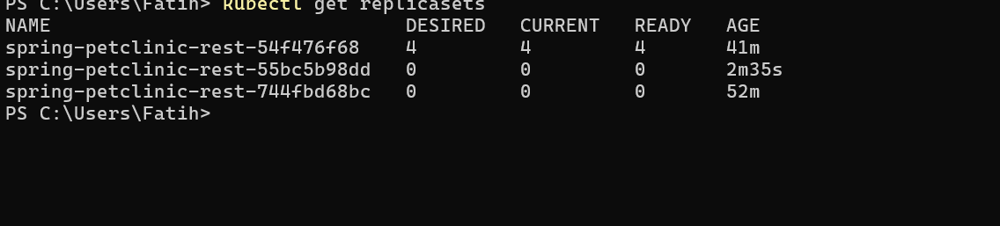

## Hello Minikube  
1. Compare the application logs before and after you exposed it as a Service.  
    Yes, The service can receive requests so that the log will record requests that have been made, it adds every time the page is refreshed.  
      
2. Notice that there are two versions of `kubectl get` invocation during this tutorial section. The first does not have any option, while the latter has `-n` option with value set to `kube-system`.  
    By using -n, we state that the service we want is from the namespace. This is needed if for example there are many different services that have the same name and are spread across many namespaces.

## Rolling Update & Kubernetes Manifest File
1. Rollback vs Recreate, Recreate requires the deletion of pods first, then recreating them, while rollback, namewise, just rolls back to its latest version

2. Try deploying the Spring Petclinic REST using Recreate deployment strategy and document your attempt.
    

    after that, editing the template utiling the nature of the replicaset that will replace the deleted pod with its template, so it will replace the version of the template in the following settings.

    Then to check the changes made, we use 
    ```
    kubectl get deployments/spring-petclinic-rest -o yaml
    ```
    

    After that, when we delete our pods, new pods will be made to replace them

    

    Lastly, we check if it runs

    

    As we can see here, it runs just like before in the tutorial, therefore we'll count it as a success.
3. Prepare different manifest files for executing Recreate deployment strategy.

    A file can be created as attached in github with the name deployment-latest.yaml, it have a little bit of different in the section strategy, then we have a new service-latest.yaml as well

    
    
    
    

    As we can see it is recreating, not rollbacking

4. What do you think are the benefits of using Kubernetes manifest files?

    Well, the benefits is obviously efficiency, we just need to apply the deployment manifest without remembering the need to remember the syntax 